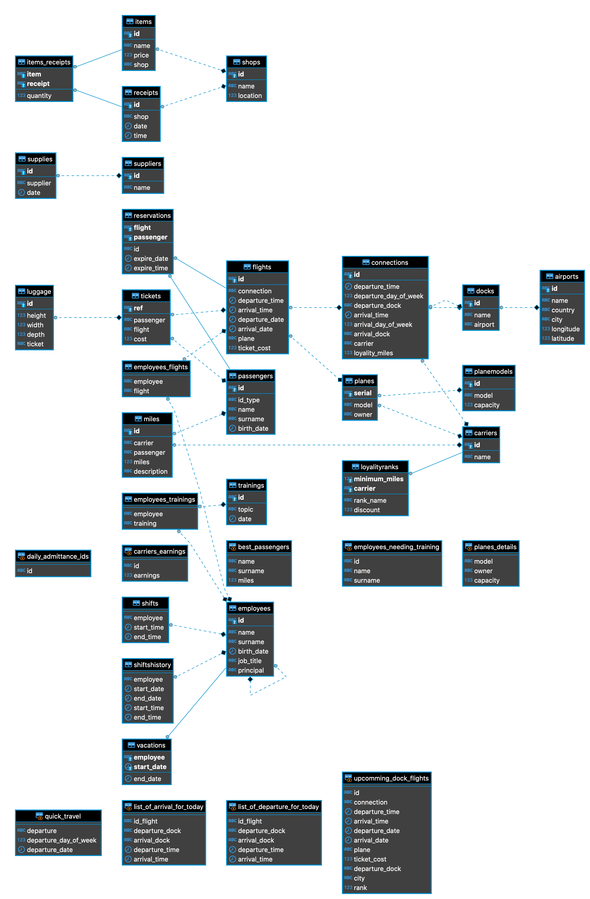

# Sky Conquest ✈️

> projekt zaliczeniowy, Bazy Danych 2020/2021.

## Członkowie zespołu

> wykorzystaliśmy emoji jako legendę, do oznaczania wkładu w projekt

- Klara Kot 🐈
- Magdalena Lipka 🌳
- Franciszek Madej 👦

## Opis projektu

Nasz projekt jest bazą danych dla krakowskiego lotniska.
Do wspólnej pracy wykorzystaliśmy serwer z systemem Linux, na którym
z pomocą `docker` oraz `docker-compose` postawiliśmy silnik PostgreSQL.

Początkowym założeniem było, aby każdy pracował nad swoją częścią ale szybko okazało się, że jest to nieefektywne rozwiązanie. Dlatego po namyśle, podporządkowaliśmy tworzenie tabel pod wymyślone przez nas funkcje, wyzwalacze i procedury - każdy wprowadzał zmiany we własnym zakresie.

## przygotowana "logika"

prezentacja w [oddzielnym pliku](./logika.org) - zawiera ona kod logiki, jak również jej opis, zastosowanie oraz testy. Podgląd możliwy przez GitHub, ale najlepiej oglądać w edytorze Emacs - pliki `.org` zawierające bloki z kodem można uruchamiać, co postaramy się pokazać podczas obrony projektu.

## Rozkład tabel

Przedstawimy je na diagramie ER:

